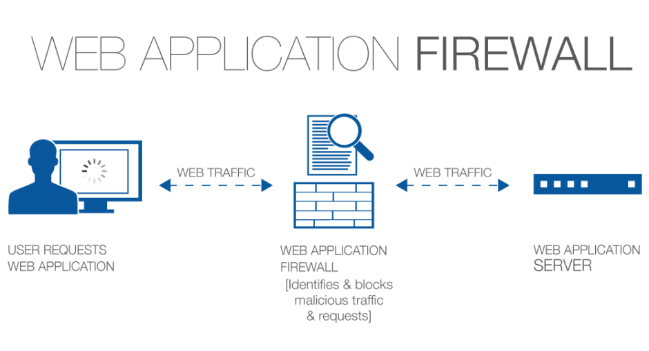

# Awesome WAF Evasion
> A curated list of awesome WAF evasion stuff.

__A Concise Definition:__ A web application firewall is a form of firewall with a set of configured rules that controls input, output, and/or access from, to, or by an application or service. It operates by monitoring and potentially blocking the input, output, or system service calls that do not meet the configured policy of the firewall. *(Source [Wikipedia](https://en.wikipedia.org/wiki/Application_firewall))*

Feel free to [contribute]().

### Contents:
- [Writeups]()
- [List of WAFs]()
- [WAF Detection]()
- [Evasion Techniques]()
- [Writeups]()
- [Research Papers]()
